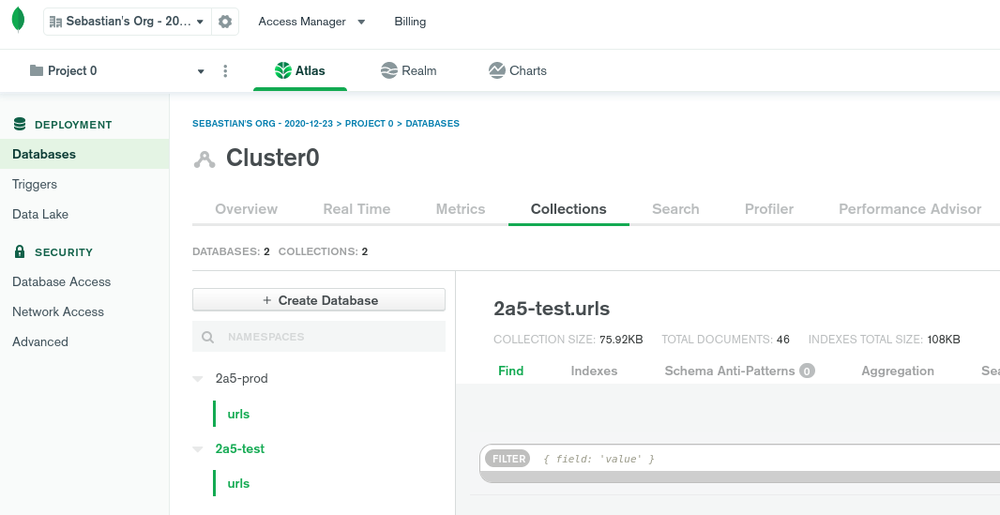
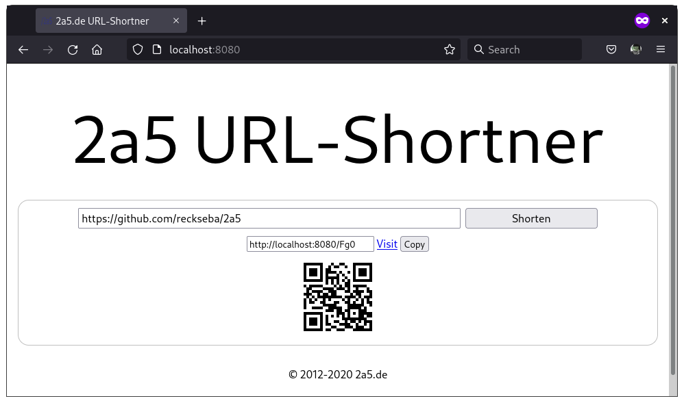
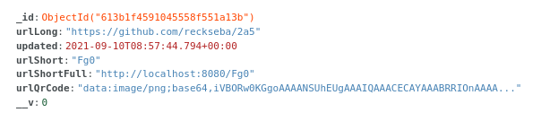

# 2a5
Open Source URL-Shortener with separated front- &amp; back-end parts based on React, Express, MongoDB &amp; Docker for local testing.

## The Idea
URLs are long and get misinterpreted very often. To keep short messages short, a url-shortener is needed.

## Reception
You should not trust any web-service out there. Therefore you should not trust 2a5.de either. There is no way I, as the hostmaster of 2a5.de, can assure you, as a client, that the software, that my server is running, is what is published here. Whatever leaves your browser must be considered public. If you want nobody else to know, what links you are shortening: host your own instance. This tutorial shows you how.

## Project Design
The goal was to provide a clean and modern web-architecture, which leaves much room for creative freedom. For example to swap out the entire front-end part by using a complete different framework than react - vue for example.

> TODO some drawings of how data flows

## Preparations
You need to install:
- git
- nodejs
- npm
- docker

Clone the repository:
```
git clone https://github.com/reckseba/2a5.git
```


## MongoDB
The easiest way to get started is by creating a free-tier cluster at https://cloud.mongodb.com.

You need to create two databases (2a5-prod and 2a5-test) with one collection (urls) per each.



## Configs
Before running any environment, you need to create three config files. You can copy the templates with this:
```
cd 2a5/config
cp process.local.template.env process.local.env
cp process.test.template.env process.test.env
cp process.prod.template.env process.prod.env
```

You need to change some values
> which ones?

## Docker Networking
Now we need to prepare our Docker network for our docker images, we'll launch later:
```
$: docker network create --subnet=172.28.0.0/16 2a5-network
070143c76205f6cfdad6c02065e6c71c167176bd3c238d03adacbf89ca70299a

$: docker network ls
NETWORK ID     NAME          DRIVER    SCOPE
070143c76205   2a5-network   bridge    local
a2d3816e55e8   bridge        bridge    local
70d838048f2b   host          host      local
a312472446d0   none          null      local

$: docker network inspect 2a5-network

[
    {
        "Name": "2a5-network",
        "Id": "070143c76205....acbf89ca70299a",
        "Created": "2021-09-10T10:53:22.525003564+02:00",
        "Scope": "local",
        "Driver": "bridge",
        "EnableIPv6": false,
        "IPAM": {
            "Driver": "default",
            "Options": {},
            "Config": [
                {
                    "Subnet": "172.28.0.0/16"
                }
            ]
        },
        "Internal": false,
        "Attachable": false,
        "Ingress": false,
        "ConfigFrom": {
            "Network": ""
        },
        "ConfigOnly": false,
        "Containers": {},
        "Options": {},
        "Labels": {}
    }
]

```

That's it. When we run the docker images, we will (create containers and) add them to this network, so they "see" each other.

## Front-End
To prepare the front-end Docker-image do the following:
```
cd 2a5/frontend/app
npm install
```
This creates a `node_modules` folder inside the `2a5/frontend/app` directory. This is all we need to prepare to be ready to start building the final front-end-app which gets generated by react. Do this inside the `app` folder:
```
npm run build
```
You'll notice a new folder called `build`, which contains a static html-css-js website - our complete front-end application the end-user will see and interact with.

This new folder `build` later gets copied to the `server` folder right next to the `app` folder.

## Back-End
Nothing to do actually...boring huh?

## Run Docker Images
```
cd 2a5
./deploy local
```
This is what will happen:


Check running containers by doing:
```
$: docker ps
CONTAINER ID   IMAGE          COMMAND                  CREATED          STATUS         PORTS                                       NAMES
d158e2aeed6f   2a5-frontend   "node server-fronten…"   13 seconds ago   Up 9 seconds   0.0.0.0:8080->8080/tcp, :::8080->8080/tcp   2a5-frontend
39511a913703   2a5-backend    "node server-backend…"   2 minutes ago    Up 2 minutes   0.0.0.0:5000->5000/tcp, :::5000->5000/tcp   2a5-backend
```

Now open your browser, visit http://localhost:8080 and shorten your first url:



Checkout your MongoDB cluster/database/collection



Execute 
```
docker images
```
to get a list of your Docker images. You should have these two for the least:
- 2a5-frontend:latest
- 2a5-backend:latest
- debian:buster-slim

## Deploy production

Let's get serious and deploy our own URL-Shortener on a live system.

Imagine you have root-access to a server out there. Preferably same os and version we used as Docker image.

install node, npm on that server machine.

ssh to your server:
```
ssh 1.2.3.4
```

and create a new user
```
sudo adduser urlshortener
```

leave the server
```
exit
```

create a new ssh key on your local machine:
```
ssh-keygen -t rsa -b 4096
```

You get asked where to put the key. Enter the full path and a meaningful name. For example:
```
/home/username/.ssh/providerurlshortener
```

Decide whether to encrypt the key by a password. If you do that, you will get asked for that password every time you ssh to that machine.

copy the pub key over to the server (new user)
```
ssh-copy-id -i .ssh/urlshortener.pub urlshortener@1.2.3.4
```

You will get asked for the user's password. Enter it and it will start copying.

Put an entry to your local  `~/.ssh/config` file:
```
Host providerurlshortener
    HostName 1.2.3.4
    User urlshortener
    IdentityFile ~/.ssh/providerurlshortener
```

Now you can ssh to your new remote user directly via:
```
ssh providerurlshortener
```

In case you want ssl for your prod you need to provide a folder named `ssl` in your home directory containing 3 files:
- privkey.pem
- cert.pem
- chain.pem

```
urlshortener@provider:~/ssl$ ls
cert.pem  chain.pem  privkey.pem
```

Those files get copied from there for both frontend and backend server.

## Let's Encrypt

> TBD

## Cleanup
```
# stop the docker frontend server
docker stop 2a5-frontend

# stop the docker backend server
docker stop 2a5-backend

# remove the docker network
docker network rm 2a5-network

# DANGER! Erase all containers
docker container prune 

# DANGER! Erase all images
docker image prune -a
```